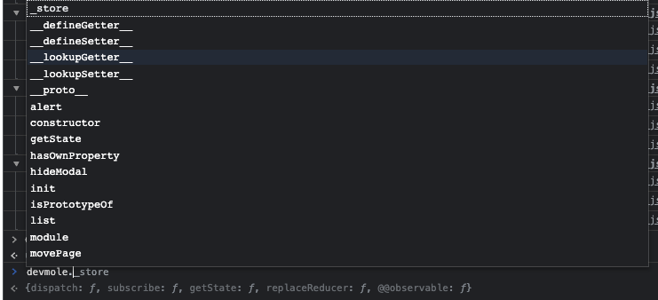
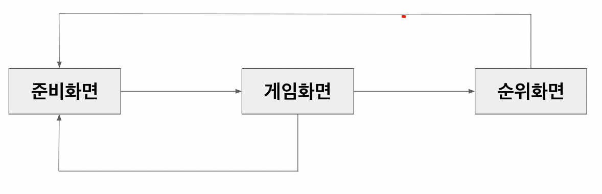
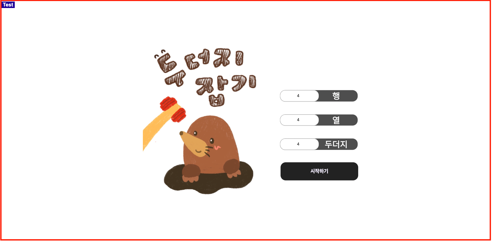
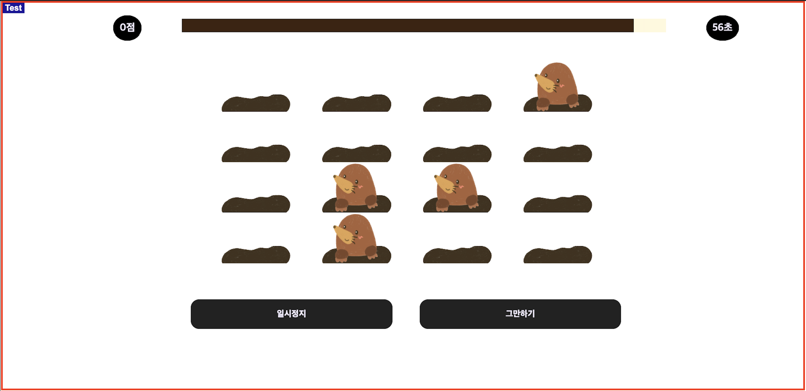
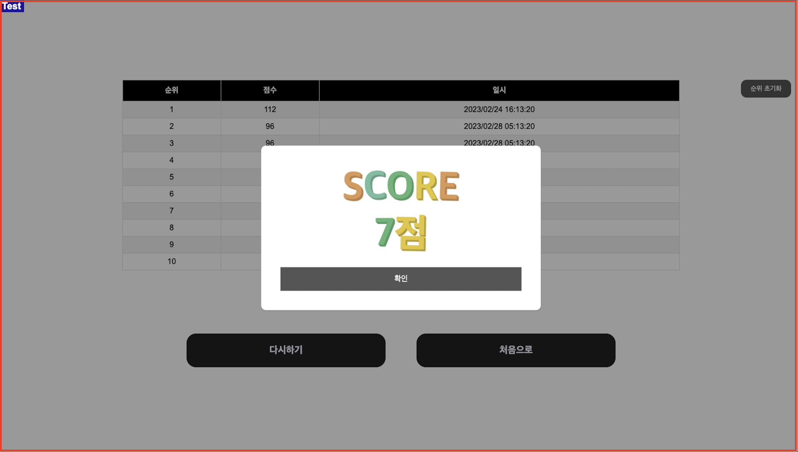

# 카카오페이 손해보험 Front-end 과제 (catching a mole)

## 화면 관리 및 구조

### Directory
```
├── .storybook
├── build  // 빌드  
├── node_modules
├── public // 템플릿 및 Static 폴더
│    ├── images
│    ├── index.html
├── src
│    ├── comp // 공통 컴포넌트
│    ├── core // 공통 코어
│        ├── List.ts // 리스트 관리
│        ├── Module.ts // 공통 로직 관리
│        ├── Mole.ts // mole로 접근되도록 메소드 랩핑 클래스
│        ├── Utils.ts // 공통 유틸리티 메소드
│    ├── css
│        ├── Common.css // 공통 css
│        ├── Page.css // 화면별 css
│    ├── hooks // 커스텀 hooks
│    ├── manager
│        ├── Alert.tsx // 얼럿 관리
│        ├── Modal.tsx // 모달 관리
│    ├── page
│        ├── Game.tsx // 게임 화면
│        ├── NotFound.tsx // 404 화면
│        ├── Rank.tsx // 순위 화면
│        ├── Ready.tsx // 준비 화면
│    ├── store
│        ├── Data.ts // 데이터 관련
│        ├── Store.ts // 데이터 + 뷰
│        ├── View.ts // 화면 관련
│    ├── stories
│        ├── common.css
│        ├── asset // Static 폴더
│        ├── comp // 공통 컴포넌트
│        ├── core // 공통 코어
│        ├── docs // 마크업
│    ├── type
│        ├── Type.ts // 공통 타입
│    ├── index.tsx
│    ├── Main.tsx
│    ├── reportWebVitals.js
│    ├── setupTests.js
├── .gitignore
├── .npmrc
├── package.json
├── package-lock.json
├── README.md
```

### 개발 환경
    - 코어: React, TypeScript
    - 상태 관리: Redux
    - 스타일링: Css, Styled Component

### Node Modules
    - react-redux(+Redux)   // 전체 데이터 및 상태 관리
    - react-router-dom      // 페이지 이동 제어
    - redux-logger          // 상태 변경 시 로그 확인
    - styled-components     // 컴포넌트 단위 스타일링
    - storybook(+addon)     // 스토리북
    
### State 
1. Redux 스토어 구조
    - mole 랩핑 클래스
    - 개발자도구 콘솔 -> devmole
        - redux tools보다 console 확인, 변경 방식 용이
        


### Style
1. css
    - common.css: 공통 관리
    - page.css: 공통을 제외한 페이지에서 따로 사용되는 css 관리
2. styled-components 
    - 스타일과 컴포넌트가 깊게 엮여 Alert에서만 사용


## 프로세스


### 준비 화면
1. 행, 열, 두더지 설정
    - 열과 행은 최소 2, 최대 6까지 입력 가능
    - 입력한 두더지의 개수 이하만큼 두더지 출현
    - 최소 1마리에서 전체 굴 개수에 절반 미만으로 입력 가능
2. 시작하기 버튼 클릭하면 게임 바로 실행
3. 왼쪽 상단 테스트 버튼 클릭 시 행, 열, 두더지 한 번에 입력 가능



### 게임 화면
1. 입력된 행과 열의 숫자만큼 두더지 굴 배치
    - 일정시간 간격으로 나타났다 사라짐
    - 두더지 클릭 or 터치 시 땅으로 숨음
2. 일시정지 버튼 클릭 시 게임 중지
3. 그만하기 버튼 클릭 시 확인 얼럿 띄우고 준비화면으로 이동
3. 왼쪽 상단 테스트 버튼 클릭 시 시간 조절 가능



### 결과 화면
1. 화면 이동시 모달로 점수 보여줌
2. 다시하기 클릭 시 지정했던 행, 열, 두더지 수로 다시 진행
3. 처음으로 진행 시 준비 화면으로 이동
4. 순위 제공
5. 순위 초기화 버튼 누르면 순위 초기화 가능
3. 왼쪽 상단 테스트 버튼 클릭 시 순위 테이블에 데이터 입력 가능



### 에러 및 개선점
#### 에러
1. 두더지 클릭 시 1점씩 쌓여야 하지만, Element가 겹치면서 클릭 시 점수가 여러점 쌓이는 케이스가 있음.
2. 랭킹순위 sort 
    - 랭킹은 최대 10개
    - arr.sort((a: {score: number, sysdate: string}, b: {score: number, sysdate: string}) => b.score - a.score).slice(0, num);
    - 리덕스 상태 에러 발생
    - 에러 발생으로 순위는 점수순이 아닌, 인덱스 순으로 10명 뽑아주고 있음.
    
#### 개선해야할 부분
1. 의미있는 마크업 구성
    - 접근성 및 반응형
    - html dom 구조
2. 스토리북
    - 사용된 코드 정의
    - 개발한 컴포넌트 추가

